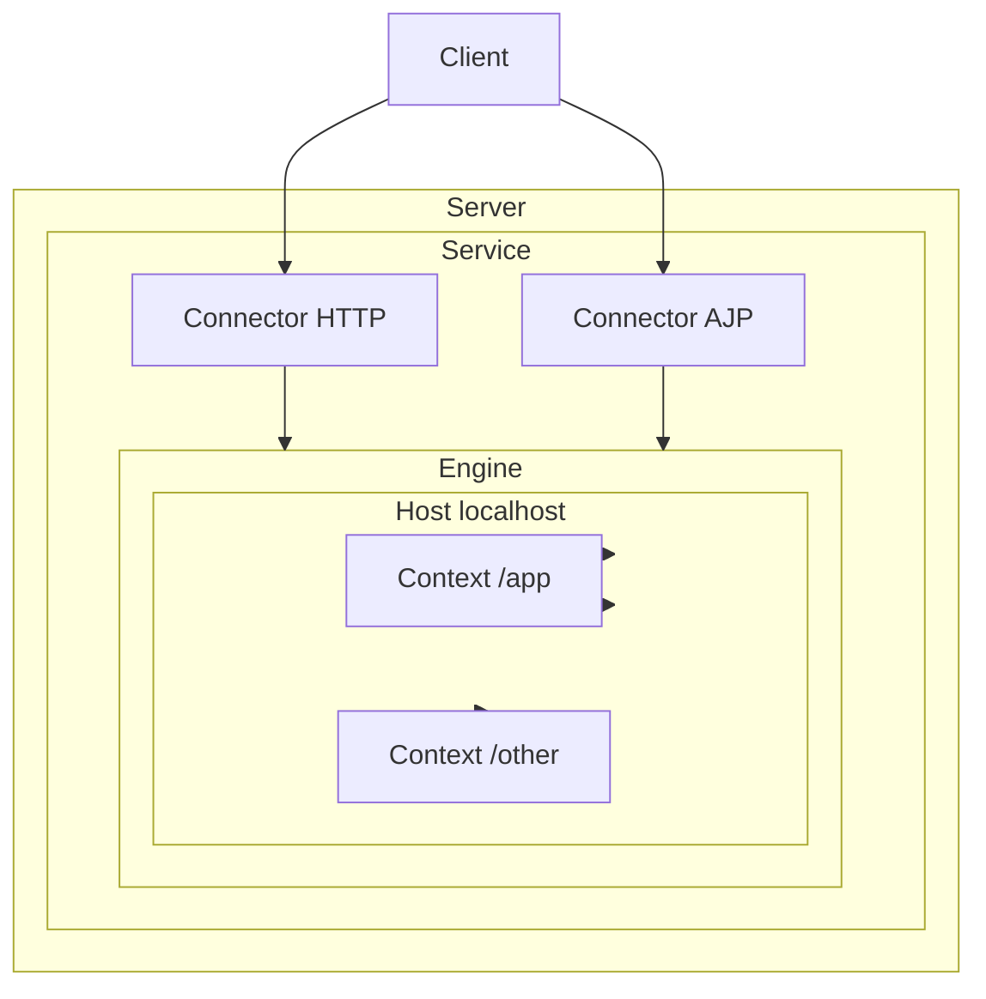

# Tomcat 学習用プロジェクト

Apache Tomcat の学習用サンプルです。Docker で Tomcat を起動し、Spring MVC（Spring Boot ではない）の WAR をデプロイして動作確認できます。

## Tomcat とは

Apache Tomcat は、**Servlet** および **JSP** の仕様に基づいた Java ウェブアプリケーションの実行環境（Servlet コンテナ）です。同時に、HTTP リクエストを受け付ける **HTTP サーバ** としても動作します。Java Servlet 仕様のリファレンス実装として開発され、現在も多くのプロダクション環境で利用されています。

## Tomcat のアーキテクチャ概要

Tomcat は階層的なコンポーネント構造を持っています。各用語の関係を理解すると、設定やデプロイの仕組みが分かりやすくなります。

### 主要コンポーネント

| コンポーネント | 説明 |
|----------------|------|
| **Server** | コンテナ全体を表す最上位の要素。1 つの Tomcat インスタンスに 1 つだけ存在します。 |
| **Service** | Server の内側にある中間コンポーネント。1 つの Engine と 1 つ以上の Connector を結び付けます。 |
| **Engine** | 特定の Service に対するリクエスト処理パイプライン。複数の Connector から届くリクエストを受け取り、処理して適切な Connector 経由でクライアントに応答を返します。 |
| **Host** | ネットワーク名（例: `localhost`、`www.example.com`）と Tomcat サーバの対応付け。1 つの Engine に複数の Host を含めることができます。 |
| **Context** | 1 つの Web アプリケーションを表します。WAR ファイルをデプロイすると、1 つの Context になります。1 つの Host に複数の Context を配置できます。 |
| **Connector** | クライアントとの通信を担当します。HTTP 用の Connector（スタンドアロン運用で主に使用）や、Apache HTTPD などと連携する AJP 用 Connector などがあります。 |

### アーキテクチャ図



---

## このプロジェクトの目的

- **Tomcat を「外から」使う体験**をするため、Spring Boot は使用していません。Spring Boot は内部に Tomcat を組み込んでおり、Tomcat の役割が分かりにくくなります。
- 代わりに **Spring MVC** でシンプルな Web アプリを WAR としてビルドし、**単体の Tomcat** にデプロイする構成にしています。これにより「Tomcat が WAR を読み込み、Servlet コンテナとしてアプリを動かしている」ことが明確になります。

## 必要環境

- Docker
- Docker Compose

## 起動方法

```bash
cd tomcat-learning
docker-compose up --build
```

初回は Maven によるビルドと Tomcat イメージの構築が行われます。完了後、以下にアクセスできます。

- **アプリケーション**: http://localhost:8080/app/
- **Tomcat 管理画面**（デフォルトでは無効）: 今回は使用しません

## ディレクトリ構成

```
tomcat-learning/
  README.md          # このファイル
  docker-compose.yml # Docker Compose 定義
  Dockerfile         # マルチステージビルド（Maven → Tomcat）
  .dockerignore      # Docker ビルド時の除外設定
  app/               # Spring MVC アプリケーション（WAR のソース）
    pom.xml          # Maven 設定
    src/main/java/   # Java ソース
    src/main/webapp/ # Web リソース（JSP 等）
```

- `app/` … Spring MVC の WAR プロジェクト。Maven でビルドすると `app.war` が生成されます。
- ルートの Docker 関連ファイル … この WAR をビルドし、Tomcat イメージに組み込んでコンテナとして起動するための設定です。

## 参考リンク

- [Apache Tomcat 公式ドキュメント - Architecture Overview](https://tomcat.apache.org/tomcat-9.0-doc/architecture/overview.html)
